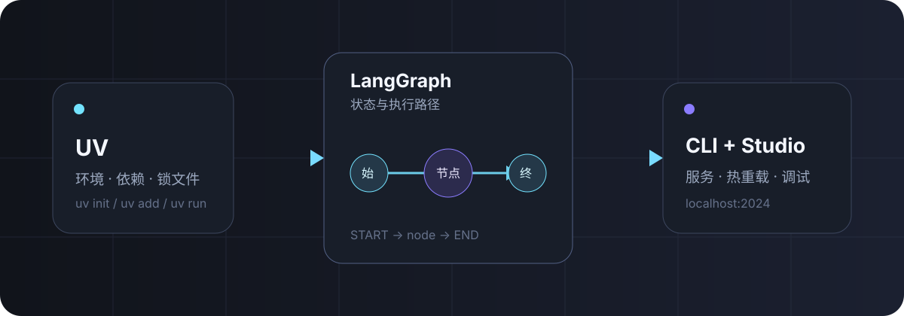

<p class="article-kicker">AGENT 开发 · 入门</p>

# UV + LangGraph CLI 入门

<p class="article-lead">用 UV 获得快速、可复现的 Python 环境，再用 LangGraph CLI 把一张状态图变成支持热重载的本地 API 服务。</p>

<p class="article-byline">发布于 2026-09-18 · 约 10 分钟</p>

{ .article-hero }

## 我们要完成什么

这篇文章会从空目录开始，完成一个不依赖模型 API Key 的最小 LangGraph 应用。最终只需运行一条命令，就能得到带热重载的本地 Agent Server：

```bash
uv run langgraph dev
```

这个组合的分工很清楚：

- **UV** 管 Python 版本、虚拟环境、依赖和锁文件；
- **LangGraph** 用节点、边和共享状态描述应用逻辑；
- **LangGraph CLI** 读取配置，把图暴露为本地 API，并连接可视化调试界面。

{ .workflow-diagram }

## 1. 安装 UV

macOS 与 Linux 可以使用官方安装脚本：

```bash
curl -LsSf https://astral.sh/uv/install.sh | sh
```

Windows PowerShell：

```powershell
powershell -ExecutionPolicy ByPass -c "irm https://astral.sh/uv/install.ps1 | iex"
```

确认安装成功：

```bash
uv --version
```

UV 不要求系统预先安装 Python；缺少指定版本时，它可以按需管理 Python。更多安装方式见 [UV 官方安装文档](https://docs.astral.sh/uv/getting-started/installation/)。

## 2. 初始化项目

创建一个 Python 3.12 应用：

```bash
uv init hello-agent --python 3.12
cd hello-agent
```

再添加 LangGraph 与 CLI。`inmem` extra 提供本地开发服务器所需的内存运行时：

```bash
uv add langgraph "langgraph-cli[inmem]"
```

!!! tip "为什么不手动激活虚拟环境？"
    `uv run` 会在执行命令前检查锁文件和环境，并自动同步依赖。你仍然可以激活 `.venv`，但入门阶段直接使用 `uv run` 更简单，也更不容易在错误的 Python 环境里执行命令。

此时的关键文件大致如下：

```text
hello-agent/
├── .python-version
├── pyproject.toml
├── uv.lock
└── src/
    └── hello_agent/
        ├── __init__.py
        └── graph.py       # 下一步创建
```

## 3. 写一张最小状态图

新建 `src/hello_agent/graph.py`：

```python title="src/hello_agent/graph.py" linenums="1"
from typing import TypedDict

from langgraph.graph import END, START, StateGraph


class State(TypedDict, total=False):
    name: str
    message: str


def greet(state: State) -> dict[str, str]:
    name = state.get("name") or "Agent Builder"
    return {"message": f"Hello, {name}!"}


builder = StateGraph(State)
builder.add_node("greet", greet)
builder.add_edge(START, "greet")
builder.add_edge("greet", END)

graph = builder.compile()
```

这里有三个核心概念：

1. `State` 是节点间共享的数据结构；
2. `greet` 是一个节点，接收当前状态并返回需要更新的字段；
3. `START → greet → END` 定义执行路径，`compile()` 得到可运行的图。

图对象命名为 `graph` 不是强制要求，但下一步配置会用 `模块路径:变量名` 精确找到它。

## 4. 配置 LangGraph CLI

在项目根目录新建 `langgraph.json`：

```json title="langgraph.json"
{
  "dependencies": ["."],
  "graphs": {
    "hello_agent": "./src/hello_agent/graph.py:graph"
  },
  "env": ".env"
}
```

| 字段 | 作用 |
| --- | --- |
| `dependencies` | 告诉服务安装当前项目，使 `src` 中的包可导入 |
| `graphs` | 注册图的名称，以及图对象所在的文件和变量 |
| `env` | 指定环境变量文件；当前示例无需密钥，但保留后便于扩展 |

创建一个空的 `.env` 文件，或者先把 `env` 字段删掉。务必将真实密钥加入 `.gitignore`，不要提交到仓库。

## 5. 启动本地服务

```bash
uv run langgraph dev
```

默认情况下，本地 API 会监听 `http://127.0.0.1:2024`。开发模式会监视源文件，修改图代码后自动重载；CLI 通常还会打开 LangGraph Studio，便于创建线程、提交输入并查看每个节点的状态变化。

如果不希望自动打开浏览器：

```bash
uv run langgraph dev --no-browser
```

如果 2024 端口被占用：

```bash
uv run langgraph dev --port 8123
```

!!! note "开发模式与生产部署"
    `langgraph dev` 使用内存运行时，适合本地开发和测试。它不是持久化的生产环境；容器构建与部署应继续了解 `langgraph build`、`langgraph up` 或托管平台。

## 6. 继续扩展

最小图跑通后，可以按这个顺序增加能力：

1. 在 `State` 中加入消息列表；
2. 添加模型节点与工具节点；
3. 使用条件边决定下一步执行哪个节点；
4. 加入 checkpointer 保存线程状态；
5. 接入 LangSmith tracing，观察耗时、输入输出与错误。

不要一开始就把模型、工具、记忆与部署全部塞进同一张图。先让一条状态转换链路跑通，再逐层增加复杂度，调试成本会低很多。

## 常见问题

### `langgraph: command not found`

优先使用项目环境运行：

```bash
uv run langgraph --help
```

并检查 CLI 是否已加入项目：

```bash
uv tree | grep langgraph-cli
```

### 修改代码后没有生效

确认使用的是 `langgraph dev`，且没有传入 `--no-reload`。如果修改了依赖或 `pyproject.toml`，停止服务后运行 `uv sync`，再重新启动。

### 图加载失败

依次检查：

- `langgraph.json` 中的文件路径是否相对项目根目录；
- 冒号后的变量名是否与代码中的 `graph` 一致；
- 包目录是否包含 `__init__.py`；
- `uv run python -c "from hello_agent.graph import graph; print(graph)"` 能否成功。

## 小结

UV 解决了“项目究竟运行在哪个 Python 和哪组依赖上”，LangGraph CLI 解决了“如何把图快速跑成可调试的服务”。两者组合后，环境、依赖与启动方式都落在仓库文件里，换一台机器也能稳定复现。

下一篇可以在这张最小图上加入真实模型与工具调用，把它扩展成一个可观察的 ReAct Agent。

## 参考资料

- [UV：创建项目](https://docs.astral.sh/uv/concepts/projects/init/)
- [UV：在项目中运行命令](https://docs.astral.sh/uv/concepts/projects/run/)
- [LangGraph CLI 源码与命令说明](https://github.com/langchain-ai/langgraph/tree/main/libs/cli)
- [LangGraph Python 快速开始](https://docs.langchain.com/oss/python/langgraph/quickstart)
