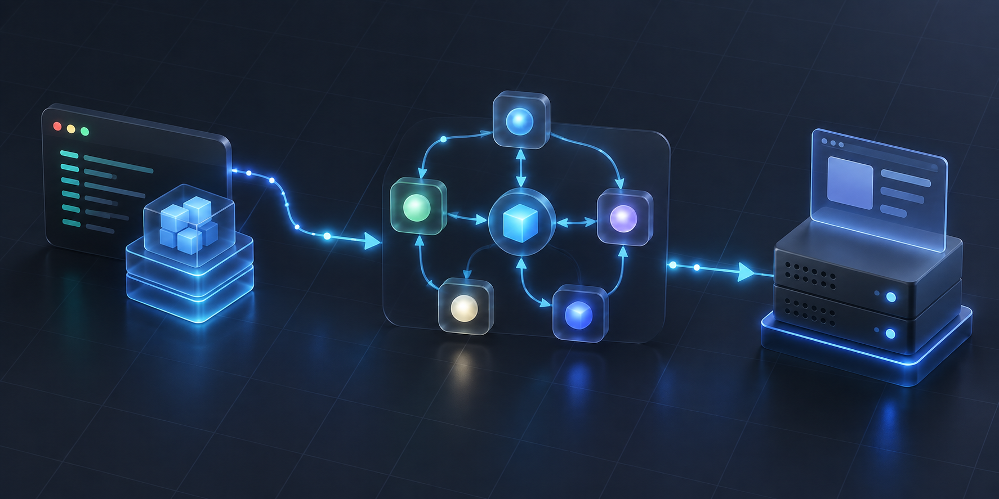

---
hide:
  - navigation
  - toc
---

<section class="hero">
  CODE · AGENTS · SYSTEMS
  <h1>把复杂技术， 讲得清楚。</h1>
  
记录 Agent 开发、工程实践与 AI 原生应用。重视原理，也重视能跑起来的代码。

  

    <a class="md-button md-button--primary" href="agent-development/uv-langgraph-cli/">开始阅读</a>
    <a class="md-button" href="agent-development/">浏览分类</a>
  

</section>

  
LATEST<h2>最新文章</h2>

  <a href="agent-development/">查看全部 →</a>

  <a class="article-card" href="agent-development/uv-langgraph-cli/">
    
    

      Agent 开发 · 约 10 分钟
      <h3>UV + LangGraph CLI 入门</h3>
      
从零搭建一个可热重载、可视化调试的 LangGraph 项目，并理解每个配置项为何存在。

      阅读全文 →
    

  </a>

  
TOPICS<h2>文章分类</h2>

  <a class="category-card" href="agent-development/">
    01
    <h3>Agent 开发</h3>
    
从工作流编排到调试、部署，构建真正可维护的智能体应用。

    1 篇文章
  </a>

